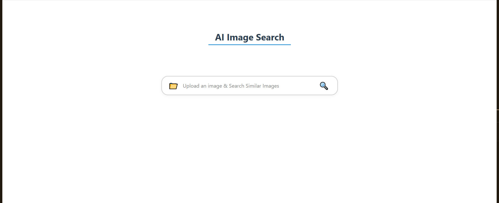
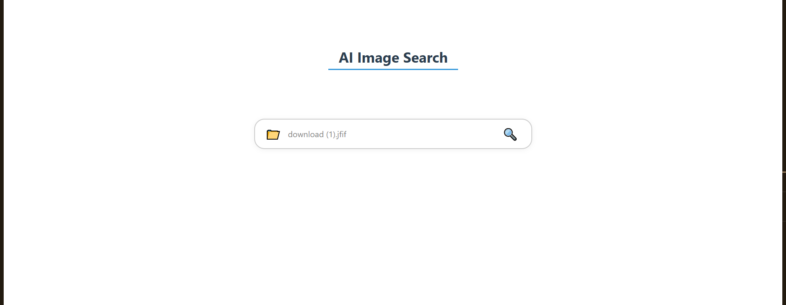
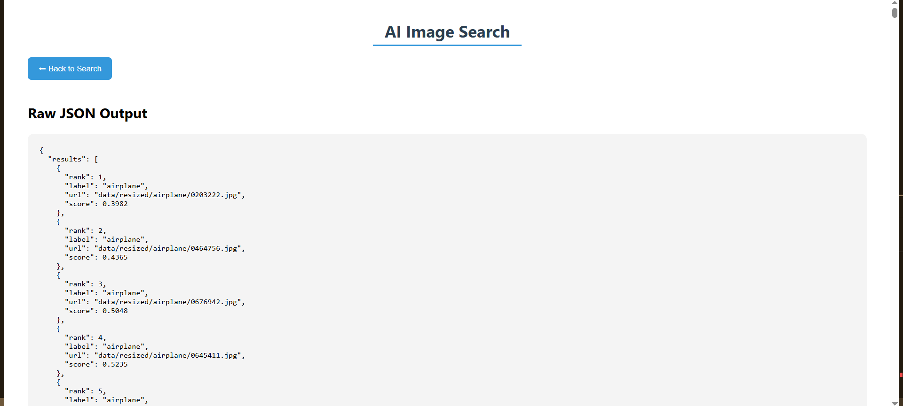

🔍 AI-Powered Image Similarity Search
```text
EfficientNetB0 + ChromaDB + FastAPI | Find visually similar images instantly.
```

🎓 About

```text
This project implements a high-performance image similarity search system using:
EfficientNetB0 for image feature extraction (1280-d embeddings)
ChromaDB for fast vector similarity search (cosine distance)
FastAPI for the backend API
```

🛠️ Tech Stack of Frontend

```text
React
css

Prerequisites to use react
->Node.js(v16 or later)
->npm(comes with the node)
```

🛠️ Tech Stack of Backend

```text
Python 3.12.11 #Don't use the currect python version as tensorflow is not supported by the latest versions     
FastAPI
Uvicorn
TensorFlow / tf-keras
EfficientNetB0
ChromaDB
NumPy, OpenCV, Pillow
```

📁 Folder Structure of Frontend

```text
frontend_image_search/
├── public/
│   └── index.html
│
├── src/
│   ├── assets/                  
│   │   └── test_images          #there are 3-3 test images for each class
│
│   ├── components/              # UI components
│   │   ├── AnimatedSearchBox.jsx
│   │   ├── AnimatedSearchBox.css
│   │   ├── Header.jsx
│   │   ├── Header.css
│   │   ├── ResultGrid.jsx
│   │   ├── ResultGrid.css
│   │   ├── Loader.jsx
│   │   └── Loader.css
│
│   ├── pages/                   # Page-level components
│   │   └── Home.jsx
│
│   ├── services/                # API integration logic
│   │   └── api.js
│
│   ├── App.js                   # App entry component
│   ├── App.css                  # (optional) Global styles
│   ├── index.js                 # ReactDOM entry point
│   └── index.css                # Global resets and base styling
│
├── package.json
├── package-lock.json
└── README.md
```

📁 Folder Structure of Backend

```text
backend/
├── main.py                  
├── config.py                
├── requirements.txt
├── routes/
│   ├── preprocess.py        
│   ├── extractor.py         
│   ├── chroma_loader.py     
│   └── search.py             
├── services/
│   ├── preprocess_service.py
│   ├── extract_service.py
│   ├── chroma_service.py
│   └── search_service.py
├── utils/
│   ├── image_utils.py       
│   ├── model.py             
│   └── chroma_client.py     
└── data/
    ├── resized/             
    └── features/            
```
    
🔄 API Flow

```text
Preprocess raw dataset → resize images to 224x224
Extract Features → EfficientNetB0 creates 1280-d embeddings
Load ChromaDB → load embeddings into ChromaDB
Search → upload a query image, get top-N similar matches
```

🛋️ Setup & Installation of backend

```text
git clone https://github.com/aadityasarda/image-search-assignment
cd backend
uvicorn main:app --reload

NOTE - when you clone this repo you will get the .npy files and because of that you need to POST all apis you need to POST one api which is /api/load-chroma you can also visit http://127.0.0.1:8000/docs and choose
/api/load-chroma -> Try it out -> execute 

Result
You will find that all the embeddings are successfully loaded in the chromadb
```

🛋️ Setup & Installation of frontend

```text
git clone https://github.com/aadityasarda/image-search-assignment
cd frontend_image_Search
npm install  -> to downlaod the nod modules
npm axios -> for backend integration
npm start -> if you find errors then remove the node modules and again run the insatll command

NOTE - Make sure your backend should be in running state 
```

📡 API Endpoints

```text
Endpoint              Method     Description

/api/preprocess        POST      Resize dataset images (run once)
/api/extract-features  POST      Extract embeddings (run once)
/api/load-chroma       POST      Load embeddings into ChromaDB (every server start)
/api/search            POST      Upload query image and search
```

🖼️ Screenshots

```text
Homepage
```



```text
UploadImage
```



```text
Results
```


